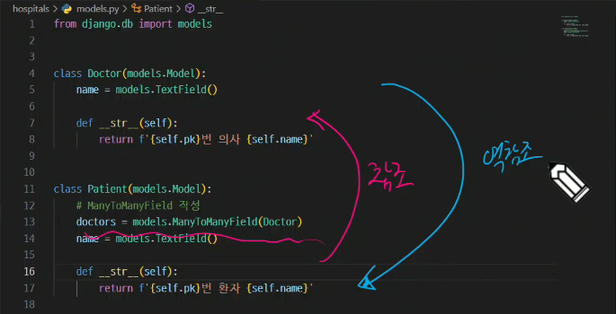

### Many to many relationships

#### Django ManyToManyField
- 다대다 필드는 서로 관계를 맺는 두 테이블 간의 변화는 없음 (모델간의 변화는 없음) -> 외래키를 작성한 모델에도 필드에 변화가 없음
- models.ManyToManyField는 중개 테이블을 만드는 코드

- doctors = models.ManyToManyField(Doctor)에서 doctors를 복수형으로 작성한 이유? 1:N과 구분하기 위해, 다대다 필드는 복수형으로 작성

#### 좋아요 기능 구현
- foreign key와 manytomanyfield가 충돌나면 주로 manytomanyfield의 related_name을 변경
- '_set'은 1:N 관계에서 많이 사용, M:N은 복수형으로 사용

