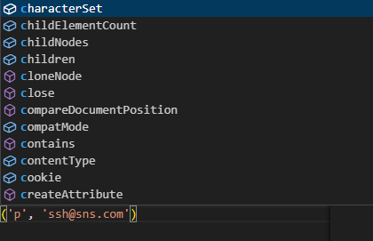

- 자바스크립트는 기본적으로 브라우저에서 구동됨

# 변수
- let : 재할당은 가능하지만 재선언은 불가능
- let은 초기값을 할당하지 않아도 에러 발생하지 X
```js
// 재할당
let number = 10
number = 20

// 재선언
let number = 10
let number = 20
```
- const : 재할당 불가능, 재선언 불가능, 비어있는 값 불가능 -> 초기값을 항상 할당해주어야 함
- 블록 스코프 ({}, 중괄호 내부)를 가지는 변수는 블록 바깥에서 접근 불가능
- 카멜 케이스(camelCase)로 변수, 객체, 함수 작성
- 대문자 스네이크 케이스는 상수에 사용
- 클래스, 생성자는 파스칼 케이스(PascalCase)로 작성

- querySelector 특징 : 첫번째로 일치하는 요소가 선택됨

- 변수를 선언할 때 선언 키워드를 쓰지않으면 JS가 기본 값인 var로 선언해줌 -> var는 JS에서 쓰지 않으므로 변수 선언시 키워드를 꼭 써줘야 함


- 보라색은 메서드, () 붙여 사용
- 파란색은 속성, '(속성) ='의 형태로 사용