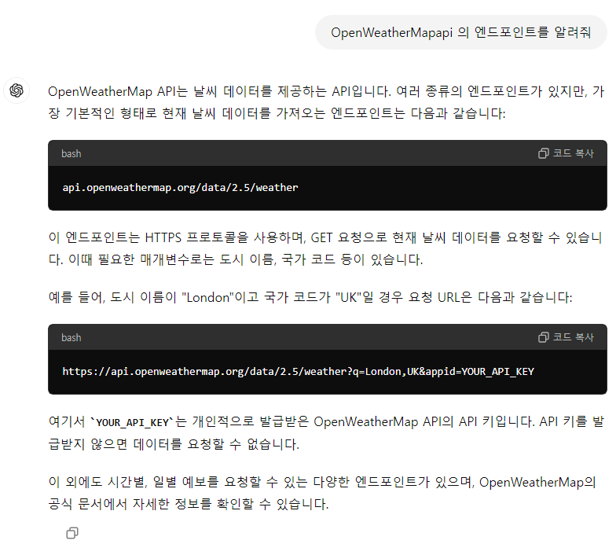
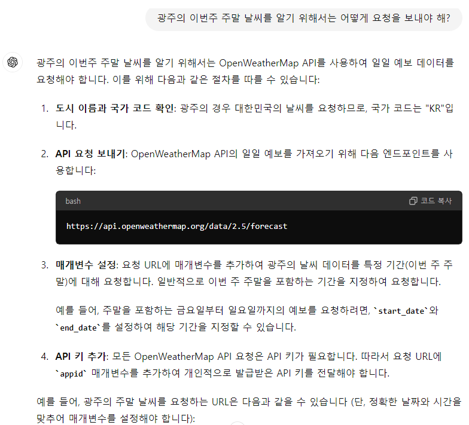
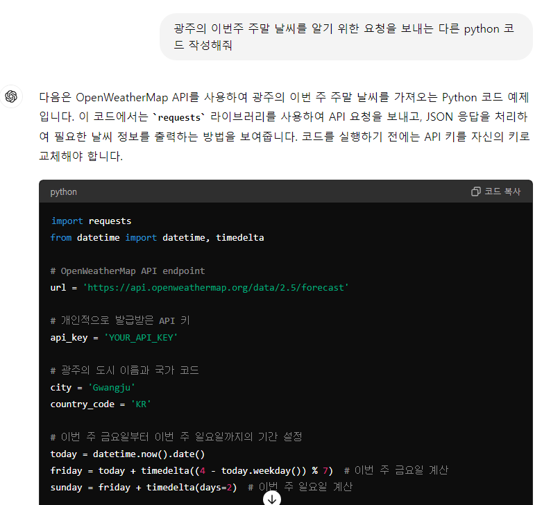
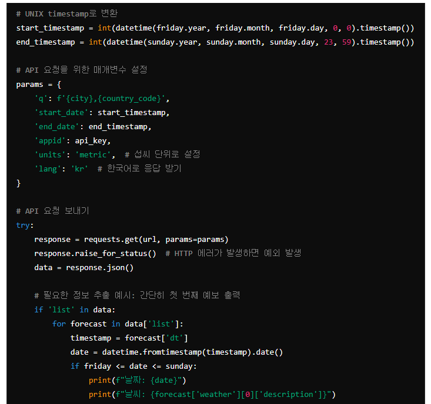
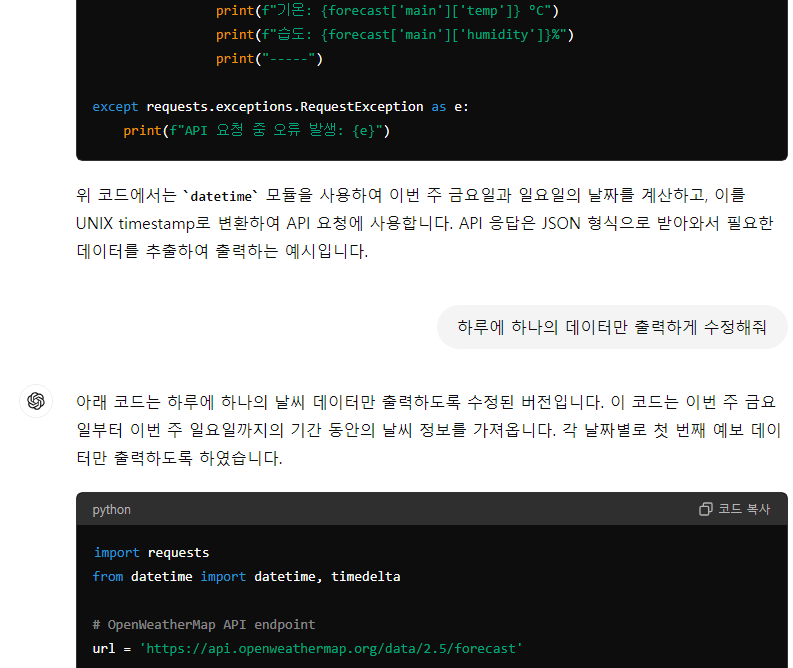
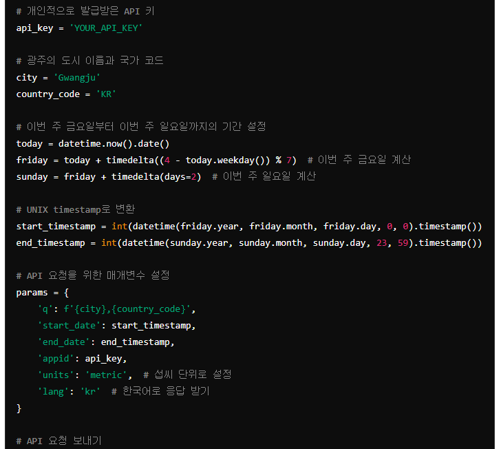
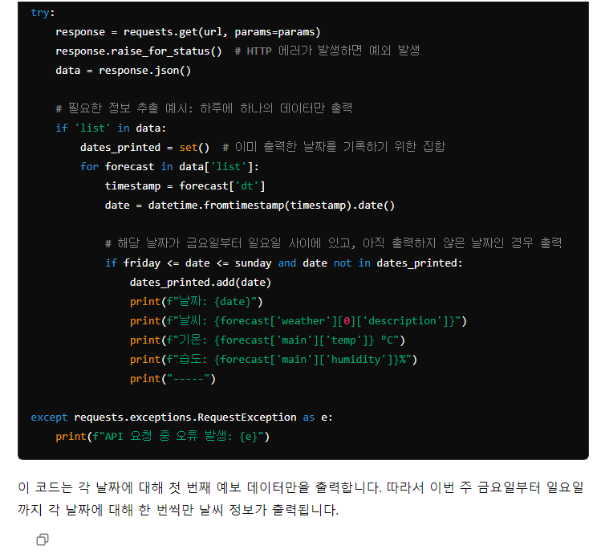
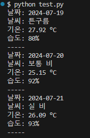

# E. 생성형 AI 활용하기

### OpenWeatherMap API 질문 : OpenWeatherMap api의 엔드포인트를 알려줘


### 광주의 이번주 주말 날씨를 알기 위한 요청 질문






```python
import requests
from datetime import datetime, timedelta

# OpenWeatherMap API endpoint
url = 'https://api.openweathermap.org/data/2.5/forecast'

# 개인적으로 발급받은 API 키
api_key = '898b69758d9c650d6704b8d28ee6f81c'

# 광주의 도시 이름과 국가 코드
city = 'Gwangju'
country_code = 'KR'

# 이번 주 금요일부터 이번 주 일요일까지의 기간 설정
today = datetime.now().date()
friday = today + timedelta((4 - today.weekday()) % 7)  # 이번 주 금요일 계산
sunday = friday + timedelta(days=2)  # 이번 주 일요일 계산

# UNIX timestamp로 변환
start_timestamp = int(datetime(friday.year, friday.month, friday.day, 0, 0).timestamp())
end_timestamp = int(datetime(sunday.year, sunday.month, sunday.day, 23, 59).timestamp())

# API 요청을 위한 매개변수 설정
params = {
    'q': f'{city},{country_code}',
    'start_date': start_timestamp,
    'end_date': end_timestamp,
    'appid': api_key,
    'units': 'metric',  # 섭씨 단위로 설정
    'lang': 'kr'  # 한국어로 응답 받기
}

# API 요청 보내기
try:
    response = requests.get(url, params=params)
    response.raise_for_status()  # HTTP 에러가 발생하면 예외 발생
    data = response.json()

    # 필요한 정보 추출 예시: 하루에 하나의 데이터만 출력
    if 'list' in data:
        dates_printed = set()  # 이미 출력한 날짜를 기록하기 위한 집합
        for forecast in data['list']:
            timestamp = forecast['dt']
            date = datetime.fromtimestamp(timestamp).date()
            
            # 해당 날짜가 금요일부터 일요일 사이에 있고, 아직 출력하지 않은 날짜인 경우 출력
            if friday <= date <= sunday and date not in dates_printed:
                dates_printed.add(date)
                print(f"날짜: {date}")
                print(f"날씨: {forecast['weather'][0]['description']}")
                print(f"기온: {forecast['main']['temp']} °C")
                print(f"습도: {forecast['main']['humidity']}%")
                print("-----")

except requests.exceptions.RequestException as e:
    print(f"API 요청 중 오류 발생: {e}")
```
#### 실행결과
