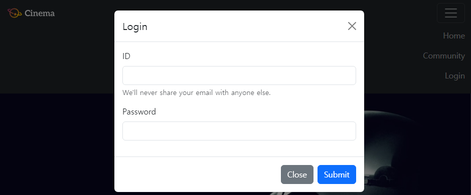
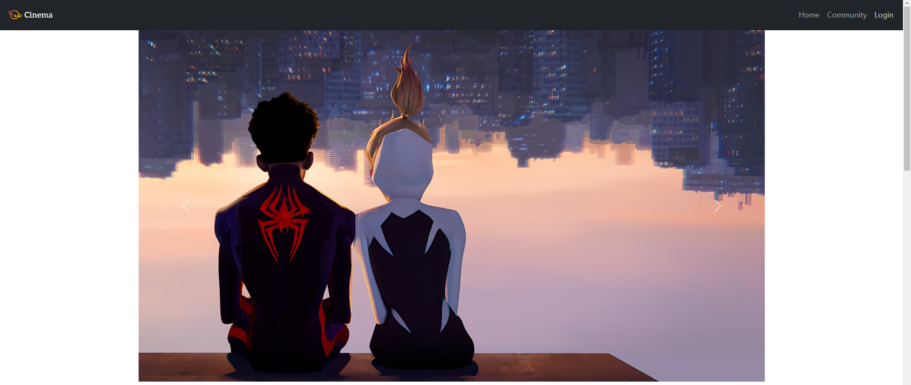
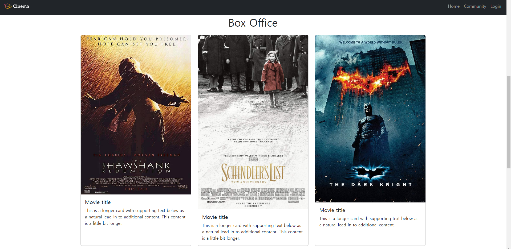
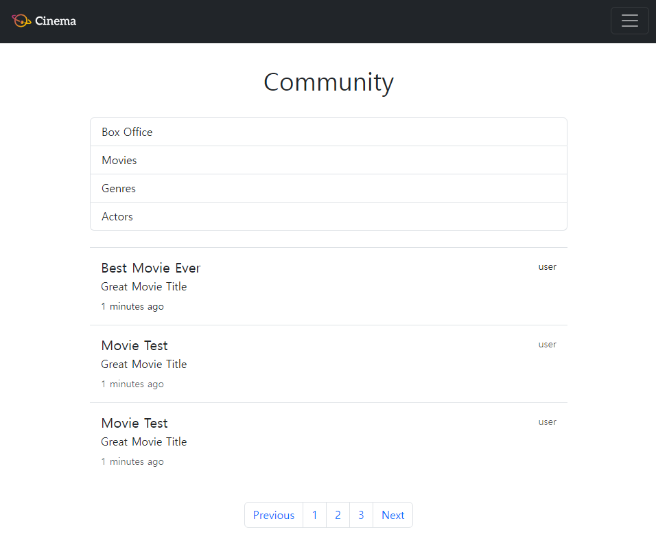
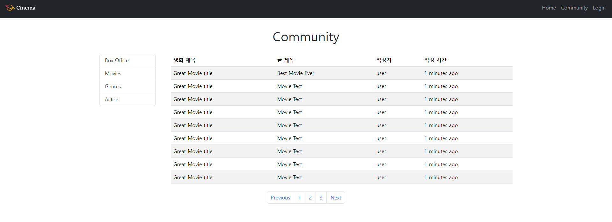

# 03-pjt : 버전2_영화

### 메인 페이지 : 01-home.html
#### Nav
- 화면을 스크롤해도 상단에 고정되어 나타나도록 nav 태그의 class에 sticky-top 작성
- 내비게이션 메뉴를 오른쪽 정렬 하기 위해 ul 태그에 ms-auto 작성하였으며, 햄버거 버튼 안에서도 메뉴들이 오른쪽 정렬되도록 li 태그에도 ms-auto 작성
- 메뉴 중 Home, Community 클릭 시 httml 파일로 이동하려면 a 태그의 href에 html파일명을 작성해야함
- Login 클릭 시 login 할 수 있는 modal 창이 나오도록 type="button", data-bs-toggle="modal"을 작성하고, data-bs-target="#exampleModal"을 작성하여 modal div의 아이디와 일치시켜 작동 가능하도록 함


#### header
- Bootstrap Carousel component 중 자동으로 넘어가는 기능이 있는 Autoplaying carousels component 사용
- viewport width 크기가 1400px 이상일 시 header width를 1320px로 고정시켜야 하므로 head 태그에 style 태그를 작성하여 @media (min-width: 1400px) {} 추가
- @media 안에 header를 감싸고 있는 div의 id를 이용 : #carouselExample의 css에 width: 1320px와 header가 가운데 고정되도록 margin: 0 auto 작성


#### section
- Bootstrap의 Grid cards 사용해 md 이하일때, md 이상일때, lg 이상일때 나타나는 카드 수 설정
```
<div class="row row-cols-1 row-cols-md-2 row-cols-lg-3 g-4">
```
- 카드의 높이를 일정하게 맞추기 위해 각각 카드 class에 h-100으로 설정
```
 <div class="card h-100">
```



### 커뮤니티 페이지 : 02-community.html


#### Aside
- 992px 미만, 이상 구분하기 위해 col-12 col-lg-2 작성
```
<Aside class="col-12 col-lg-2">
```

#### Section
- 992px 미만 : Bootstrap list component 사용 (list-Custom content)
- 992px 이상 : Bootstrap table component 사용
- 두 크기일 때 각각의 section이 나올 수 있도록 d-none, d-lg-none 사용
```
    <Section class="d-none d-lg-block col-lg-10">
```
```
    <section class="d-lg-none my-4">
```

#### Pagination
- Bootstrap Pagination component 사용
```
<ul class="pagination d-flex justify-content-center my-2">
```