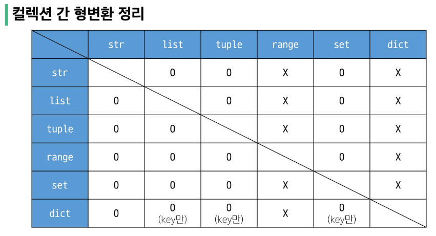

#### 형변환
```python
print(int('10', 16)) # 16 ('10'을 16진수로 인식해 계산한 값 출력)

print(int('10', 2)) # 2 (2진수 '10'을 10진수로 계산해 출력)
```
- 문자열을 변경하고 싶으면 문자열을 리스트로 형변환 후 바꾸고 다시 문자열로?
```python
    s = 'aaaaa'
    list_s = list(s)
    print(list_s)

    list_s[2] = 't'
    print(list_s)

    str_s = str(list_s)
    print(str_s)
```
- str() 형변환 함수는 list를 형변환 할 수 없음 (즉, list를 문자열로 바꿀 수 없음)

#### 두 변수의 값을 바꿀 때
```python
    a = 10
    b = 20

    a, b = b, a

    print(a, b) # 20 10
```

#### 튜플 표현
- 0개 이상의 객체를 포함하며 데이터 목록을 저장
- 값 중복 가능
- 소괄호(`()`)로 표기
- 데이터는 어떤 자료형도 저장할 수 있음

    ```python
    my_tuple_1 = ()

    my_tuple_2 = (1,)
    # 만약 my_tule_2 = (1)이라고 쓰면 튜플이 아닌 int 1로 값이 저장됨
    # 따라서 요소가 하나인 tuple을 생성할때는 ','를 반드시 뒤에 붙여야 함

    my_tuple_3 = (1, 'a', 3, 'b', 5)
    ```

#### 튜플은 어디에 쓰일까?
- 튜플의 불변 특성을 사용한 안전하게 여러 개의 값을 전달, 그룹화, 다중 할당 등
- 개발자가 직접 사용하기 보다 ‘파이썬 내부 동작’에서 주로 사용됨

    ```python
    # 다중 할당
    x, y = (10, 20)

    print(x)  # 10
    print(y)  # 20

    # 파이썬은 쉼표를 튜플 생성자로 사용하니 괄호는 생략 가능
    x, y = 10, 20
    ```

#### range 특징
- 증가 값이 음수이면 감소 / 증가 값이 양수이면 증가
- 증가 값이 음수이면 시작 값이 끝 값보다 커야 함
- 증가 값이 양수이면 시작 값이 끝 값보다 작아야 함

#### range 예제
```python
my_range_1 = range(5)
my_range_2 = range(1, 10)
print(my_range_1)  # range(0, 5)
print(my_range_2)  # range(1, 10)

# 리스트로 형 변환 시 데이터 확인 가능
print(list(my_range_1)) # [0, 1, 2, 3, 4]
print(list(my_range_2)) # [1, 2, 3 ,4 ,5 ,6, 7, 8, 9]

# 주로 반복문과 함께 활용
for i in range(1, 10):
    print(i)  # 1 2 3 4 5 6 7 8 9
for i in range(1, 10, 2):
    print(i)  # 1 3 5 7 9
```

#### dict `딕셔너리`
- 1)key - value 쌍으로 이루어진 2)순서와 3)중복이 없는 4)변경 가능한 자료형
- Non-sequence Types

#### 딕셔너리 표현
- key는 변경 불가능한 자료형만 사용 가능 (str, int, float, tuple, range …)
- value는 모든 자료형 사용 가능
- 중괄호(`{}`)로 표기

```python
my_dict = {'apple': 12, 'list': [1, 2, 3]}

# 일반적으로 아래와 같이 작성
my_dict = {
    'apple': 12,
    'list': [1, 2, 3]
    }

# 값으로 바로 접근 불가, 딕셔너리는 키를 통해 값을 얻어냄
print(my_dict['apple']) # 12 (키로 접근해 값을 얻어내는 방법)

# 새로운 키 추가
my_dict['banana'] = 50

# 키는 중복이 허용되지 않기 때문에 값만 업데이트 됨
my_dict['banana'] = 1000

# Q) my_dict의 두번째 요소는 무엇일까?
my_dict = {
    'apple': 12,
    'list': [1, 2, 3]
    }
# 딕셔너리는 순서가 없으므로 인덱스가 존재하지 X, 따라서 두번째 요소는 없음
```
- 주의) 딕셔너리는 순서가 없으므로 인덱스가 존재하지 않음

#### set `세트`
- 순서와 중복이 없는 변경 가능한 자료형
- 순서가 없으므로 인덱스도 존재하지 않음
- 집합 자료형이라고도 부름
- a = {} 형태로 되어있으면 파이썬은 a를 딕셔너리로 인식, 따라서 a = set()으로 작성해야 세트로 인식
- 중복 제거나 집합 연산을 사용할 때 주로 사용 (중복은 제거하지만 순서는 변할 수 있어 다시 맞춰줘야함)

#### 세트 표현
- 수학에서의 집합과 동일한 연산 처리 가능
- 중괄호(`{}`)로 표기

    ```python
    my_set_1 = set()
    my_set_2 = {1, 2, 3}
    my_set_3 = {1, 1, 1}

    print(my_set_1)  # set()
    print(my_set_2)  # {1, 2, 3}
    print(my_set_3)  # {1}
    ```

#### 세트의 집합 연산
- 중복이 없으므로 집합 연산이 가능함
```python
my_set_1 = {1, 2, 3}
my_set_2 = {3, 6, 9}

# 합집합
print(my_set_1 | my_set_2)  # {1, 2, 3, 6, 9} (3은 2개 존재하지만 중복되어 나오지 않음)

# 차집합
print(my_set_1 - my_set_2)  # {1, 2}

# 교집합
print(my_set_1 & my_set_2)  # {3}
```

#### None
- 완전히 값이 없는 '무'의 형태가 아닌 '값이 없음'을 표현하는 타입

#### Collection
- 여러 개의 항목 또는 요소를 담는 자료 구조
- str, list, tuple, set, dict
#### 컬렉션 정리
|     컬렉션    	|     변경 가능 여부    	|     순서 여부    	|          	|
|:-------------:	|:---------------------:	|:----------------:	|:--------:	|
|       str     	|            X          	|         O        	|  시퀀스  	|
|      list     	|            O          	|         O        	|  시퀀스  	|
|      tuple    	|            X          	|         O        	|  시퀀스  	|
|       dict     	|            O          	|         X        	| 비시퀀스 	|
|      set     	|            O          	|         X        	| 비시퀀스 	|


#### 명시적 형변환 예시
- str -> integer : 형식에 맞는 숫자만 가능
```python
print(int('1'))  # 1

# ValueError: invalid literal for int() with base 10: '3.5'
print(int('3.5')) # 3.5라는 문자열을 int로 바꿀 수 없음

print(int(3.5))  # 3 (소수 3.5를 int로 형변환 가능)
print(float('3.5'))  # 3.5 (float의 경우 '3.5'문자열을 바꿀 수 있음)
```
#### 형변환 참고


#### 비교 연산자
- is : 같음
- is not : 같지 않음

#### is 비교 연산자
- 매모리 내에서 같은 객체를 참조하는지 확인
- `==` 는 동등성(equality), `is` 는 식별성(identity)
- '=='는 값만 같은지 비교하지만 'is'는 주소도 같은지까지 비교함
- 값을 비교하는 `==` 와 다름
- is는 None과 Boolean을 비교할 때 주로 사용
  ```python
  print(2.0 == 2)  # True
  print(1 == True)  # True (암시적 형변환 일어남)

  # SyntaxWarning: "is" with a literal. Did you mean "=="?
  # ==은 값(데이터)을 비교하는 것이지만 is는 레퍼런스(주소)를 비교하기 때문
  # 아래 조건은 항상 False이기 때문에 is 대신 ==를 사용해야 한다는 것을 알림
  print(1 is True)  # False
  print(2 is 2.0)  # False
  ```

#### 논리 연산자
- and(논리곱), or(논리합), not(논리부정)
- 비교 연산자의 출력값은 Boolean(True, False), 논리 연산자의 출력값은 평가값 (True, False로 나오지만 True, False로 평가하는 것이고 True = 1, False = 0으로 평가)
- **중요**
```python
    print('a' and 'b') # 'b'
    print(1 and 3) # '3'
    # 앞의 값이 True일 경우 뒤의 값을 본다. 즉, 뒤의 값을 평가한다. 따라서 위 코드의 경우 'a'가 값이 들어있으므로 True로 평가돼 다음 값을 본다. 'b'도 값이 들어있으므로 True로 평가되고 평가값은 최종값인 뒤의 값 'b'가 저장됨
    print([] and 3) # []
    # 빈 리스트는 False로 보고 값이 들어있는 리스트는 True, 따라서 []가 False로 평가돼 뒤 값은 보지 않고 평가값으로 []가 출력됨
```

#### 단축평가
- 논리 연산에서 두 번째 피연산자를 평가하지 않고 결과를 결정하는 동작

#### 단축평가 예시 문제
- 값이 들어있으면 True, 값이 None이면 False로 평가함

```python
  vowels = 'aeiou'

  # 참고 : in 연산은 값이 안에 있는지 없는지 판단해 True, False를 결과로 출력

  print(('a' and 'b') in vowels)  # False
  # 먼저 'a' and 'b'가 실행되는데 'a'는 값이 들어있으므로 True로 판단, 'b'도 값이 들어있으므로 True로 판단, But. 최종적으로 'a' and 'b' 결과 'b'가 나옴
  print(('b' and 'a') in vowels)  # True
  # 먼저 'a' and 'b'가 실행되는데 'a'는 값이 들어있으므로 True로 판단, 'b'도 값이 들어있으므로 True로 판단, But. 최종적으로 'a' and 'b' 결과 'a'가 나옴
```

### 멤버십 연산자
- 특정 값이 시퀀스나 다른 컬렉션(set, dict 포함)에 속하는지 여부를 확인
- dict의 경우 값이 있는지 없는지는 판단 불가능, 키가 있는지 없는지만 확인 가능

|       기호      	|                                    내용                                  	|
|:---------------:	|:------------------------------------------------------------------------:	|
|        in       	|        왼쪽   피연산자가 오른쪽 피연산자의 시퀀스에 속하는지를 확인      	|
|     not   in    	|     왼쪽   피연산자가 오른쪽 피연산자의 시퀀스에 속하지 않는지를 확인    	|

#### 연산자 우선순위

|     우선순위    	|             연산자            	|               내용             	|
|:---------------:	|:-----------------------------:	|:------------------------------:	|
|       높음      	|               ()              	|        소괄호   grouping       	|
|                 	|               []              	|        인덱싱,   슬라이싱      	|
|                 	|               **              	|             거듭제곱           	|
|                 	|             +,   -            	|     단항   연산자 양수/음수    	|
|                 	|          *,   /, //, %        	|          산술   연산자         	|
|                 	|             +,   -            	|          산술   연산자         	|
|                 	|     <,   <=, >, >=, ==, !=    	|          비교   연산자         	|
|                 	|          is,   is not         	|           객체   비교          	|
|                 	|          in,   not in         	|         멤버십   연산자        	|
|                 	|               not             	|           논리   부정          	|
|                 	|               and             	|            논리   AND          	|
|       낮음      	|               or              	|            논리   OR           	|


#### 실습 : 1677.깊은 복사와 indexing 접근
```python
catalog = [
    ['시간의 틈', '반짝임의 어둠', '망각의 경계'],
    ['연기의 수수께끼', '장면의 고백', '드라마의 그림자'],
    ['황금의 칼날', '비열한 간신', '무명의 영웅'],
    ['성공의 열쇠', '내면의 변화', '목표의 달성'],
]

backup_catalog = [catalog[0], catalog[1], catalog[2], catalog[3]]

# backup_catalog = catalog : 얕은 복사, catalog가 backup에 할당된 정도, catalog 값 바꾸면 backup도 바뀜, why? 같은 주소를 가리키고 있기 때문
# backup_catalog = catalog.copy() : 얕은 복사
# backup_catalog = catalog[::] : 얕은 복사
# backup_catalog = capy.capy(catelog) : 얕은 복사
# backup_catalog = copy.deepcopy(catalog) : 깊은 복사 (import copy 사용)


''' 
도서 제목 '성공의 열쇠', '내면의 변화', '목표의 달성' 을 각각
'성공을 향한 한 걸음', '내 삶의 변화', '목표 달성의 비밀' 가 되도록 변경하시오.
'''
catalog[3] = ['성공을 향한 한 걸음', '내 삶의 변화', '목표 달성의 비밀']

print('catalog와 backup_catalog를 비교한 결과')
# 식별 연산자로 catalog와 backup_catalog를 비교한 결과를 출력하시오.
print(catalog == backup_catalog)

print('backup_catalog : ')
print(backup_catalog)
print()

print('catalog : ')
print(catalog)
```
- 얕은 복사 : 복사한 리스트도 같은 주소를 참조
- 깊은 복사 : 전체를 복사하기 때문에 완전히 새로운 리스트를 만듦, 따라서 리스트 값은 같지만 같은 주소를 참조하고 있지는 않으므로 한쪽 리스트에서 값을 바꿔도 복사된 다른 리스트의 값이 바뀌지 않음