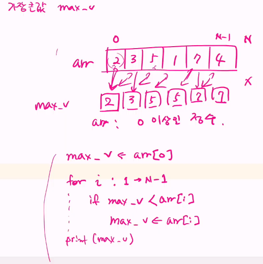

#### SWEA 4828 : min max
```python
# 내 풀이
T = int(input())

for test_case in range(1, T + 1):
    n = int(input())
    num_lst = list(map(int, input().split()))
    # 모든 값이 음수일 경우도 존재하므로 값에 0을 넣는 것은 좋지 X
    max_num = 0
    min_num = num_lst[0]
    
    for i in num_lst:
        if max_num < i:
            max_num = i
        
        if min_num > i:
            min_num = i
            
    print(f'#{test_case} {max_num - min_num}')
        
```
- psudo 코드와 그림


```python
# 답안 예시
T = int(input()) # 테스트케이스 개수

for tc in range(1, T+1):
    N = int(input())
    arr = list(map(int, input().split()))
    
    max_v = arr[0]
    for i in range(1, N):
        if max_v < arr[i]:
            max_v = arr[i]

    min_v = arr[0]
    for i in range(1, N):
        if min_v > arr[i]:
            min_v = arr[i]

    print(f'#{tc} {max_v - min_v}')
```

#### 버블정렬
```python
N = 5
arr = [55, 7, 78, 12, 42]

for i in range(N-1, 0, -1): # 각 구간의 끝 인덱스 i
    for j in range(i): # 각 구간에서 두 개씩 비교할 때 왼쪽 원소의 인덱스 j
        if arr[j] > arr[j+1]: # 왼쪽 원소가 더 크면 교환
            arr[j], arr[j+1] = arr[j+1], arr[j]

print(*arr)
```

#### 과목평가 오답
```python
first = 12
second = 7

result = first > second and second < 3
print(result)
```
- 출력결과 7 (X) False(O)

```python
num = [0, 1, 2, 3, 4, 5, 6, 7, 8]
for i in num:
    if i % 2 == 0:
        print(i)
```
- 짝수만 출력하는 코드에서 0은 출력? 출력됨
```python
num = [0, 1, 2, 3, 4, 5, 6, 7, 8]
for i in num:
    if i % 2 != 0:
        print(i)
```
- 홀수만 출력하는 코드에서 0은 출력? 출력안됨

#### 연습문제2 배열 활용 예제 : Gravity
```python
N = int(input())
lst = list(map(int, input().split()))
max_v = 0

for i in range(N-1):
    base_l = lst[i]
    # base_l보다 작은 길이의 갯수를 셈
    cnt = 0
    for j in range(i+1, N):
        if lst[j] < base_l:
            cnt += 1

    if max_v < cnt:
        max_v = cnt

    print(max_v)
```

#### 파일 가져와서 input 입력으로 넣기
- 입력으로 넣을 값이 들어있는 txt 파일을 .py 파일과 같은 곳에 넣어두고
```python
import sys
sys.stdin = open('1206.txt', 'r')
```
