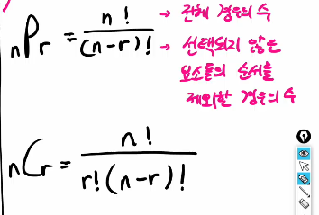
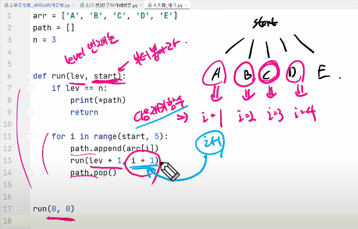

```python
arr = ['O', 'X']
path = []

def run(lev):   # lev번째 요소
    if lev == 3:    # 원소 3개를 모두 고려함
        print(path)
        return
    
    for i in range(2):  # 후보군 (데려갈지 말지)
        path.append(arr[i]) # 경로추가
        run(lev + 1)    # 다음 level을 고려해라
        path.pop()  # 경로 삭제
        
run(0)
```

- 이름을 출력하는 코드를 추가하여 부분집합 코드 완성
```python
arr = ['O', 'X']
path = []
name = ['MIN', 'CO', 'TIM']

def print_name():
    print('{', end=' ')
    for i in range(3):
        if path[i] == 'O':
            print(name[i], end=' ')
    print('}')

def run(lev):
    if lev == 3:
        print_name()
        return

    for i in range(2):
        path.append(arr[i]) # 경로추가
        run(lev + 1)    # 다음 level을 고려해라
        path.pop()  # 경로 삭제

run(0)
```
- 출력 순서를 바꾸고 싶으면 (X, X, X 부터 출력하고 싶다면) arr = ['X', 'O']로 바꿔주면됨



- 조합

  
```python
path = []
n = 3

def run(lev, start):
    if lev == n:
        print(*path)
        return

    for i in range(start, 7):
        path.append(i)
        run(lev + 1, i)
        path.pop()

run(0, 1)
```

### Greedy
- 결정이 필요할 때, 현재 기준으로 가장 좋아보이는 선택지로 결정하여 답을 도출하는 알고리즘

#### 그리디의 핵심 조건
- 탐욕적 선택 조건 : 각 단계의 선택이 이후 선택에 영향을 주지 않는다.
- 최적 부분 구조 : 각 단계의 최선의 선택이, 전체 문제의 최선의 해가 된다.
1. 각 단계에서 최적해를 찾아야 한다.
2. 단계의 결과들을 합하는 방법을 찾아야 한다.
3. 각 단계의 합 == 전체 문제의 합이라는 것을 증명해야한다.
- 그리디 문제들을 잘 해결하는법? 유형을 많이 보자 (예외 케이스를 많이 봐야 함)
- 깊이 우선 탐색, 그리디는 많은 유형을 보는 것이 중요


```python
# after live
def subset(level):
    if level == N:
        print(result)
        sum_value = ''
        for i in range(N):
            if result[i]:
                sum_value += arr[i]
        print(sum_value)
        return

    # result[level] = 0
    # subset(level+1)
    #
    # result[level] = 1
    # subset(level+1)

    for i in range(2):
        result[level] = i
        subset(level+1)

arr = ['a', 'b', 'c', 'd']
N = len(arr)

result = [0] * N

subset(0)
```
- 순열
```python
def permutation(level):
    if level == N:
        print(result)
        for i in range(N):
            idx = result[i]
            print(arr[idx], end=' ')
        print()
        return

    for i in range(N):
        if not used[i]:
            result[level] = i
            used[i] = True
            permutation(level+1)
            used[i] = False

arr = ['a', 'b', 'c', 'd']
N = len(arr)

result = [0] * N

used = [False] * N
result = [0] * N
permutation(0)
```
```python
def permutation(level):
    if level == K:  # level이 K개 일 때까지 내려감
        print(result)
        for i in range(K):  # 출력도 K개만
            idx = result[i]
            print(arr[idx], end=' ')
        print()
        return

    for i in range(N):
        if not used[i]:
            result[level] = i
            used[i] = True
            permutation(level+1)
            used[i] = False

arr = ['a', 'b', 'c', 'd']
N = len(arr)

result = [0] * N
K = 3   # 출력하는 개수를 제한하고 싶은 경우
used = [False] * N
result = [0] * K    # result의 개수를 K개로 설정
permutation(0)
```
- 조합
```python

```