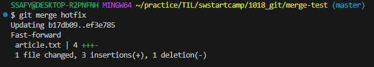

## Branch Scenario

### 개요
- Branch 장점
1. 독립된 개발 환경을 형성하기 때문에 원본(master)에 대해 안전
2. 하나의 작업은 하나의 브런치로 나누어 

### master(main) 브랜치의 의미와 역할
- 기본 브랜치 (Default Branch)
  - 저장소의 초기 상태를 나타내며, 일반적으로 프로젝트의 가장 최신 버전 또는 배포 가능한 안정적인 코드를 포함
- 기준점
  - 다른 브랜치가 파생되는 기준점으로 사용됨
- 변경사항 통합
  - 다른 브랜치에서 작업한 기능이나 버그 수정을 완료한 후, 코드 리뷰와 테스트를 거쳐 master(또는 main)로 병합하는 과정 거침

### git branch
- 브랜치 조회, 생성, 삭제 등 브랜치와 관련된 git 명령어
- git branch : 브랜치 목록 확인
- git branch -r : 원격 저장소의 브랜치 목록 확인
- git branch <브랜치 이름> : 새로운 브랜치 생성
- git branch -d <브랜치 이름> : 브랜치 삭제 (병합된 브랜치만 삭제 가능)
- git branch -D <브랜치 이름> : 브랜치 삭제 (강제 삭제)

### git switch
- 현재 브랜치에서 다른 브랜치로 HEAD를 이동시키는 명령어
- git switch <다른 브랜치 이름> : 다른 브랜치로 전환
- git switch -c <브랜치 이동> : 새 브랜치 생성 후 전환
- git switch -c <브랜치 이동> <existing-branch-name> : 특정 커밋(<existing-branch-name>)에서 현재의 커밋 기준으로 새 브랜치 생성하고 전환 
- 주의 사항 : git add를 하지 않았던, Staging area에 한 번도 올라가지 않은ㄴ 새파일은 브랜치가 바뀌더라도 계속 유지됨 (관리되는 항목이 아니기 때문) 

### HEAD
- 현재 브랜치나 commit을 가리키는 포인터 (현재 내가 바라보는 위치)

### branch 생성 및 조회
1. 현재 위치(master 브랜치의 최신 commit)에서 login 브랜치를 생성

- git log --oneline으로도 확인 가능

- master4 생성 후 log 확인하면 HEAD가 이동한 것 볼 수 있음

- HEAD를 login으로 옮기면 login이후 commit은 보이지 않음

- 모든 commit을 보고 싶다면 --all 붙이기

2. master 브랜치에서 article.txt작성한 master4가 사라짐

### branch에서 commit 생성
1. login 브랜치에서 article.txt 파일 수정 (login1 작성)

2. test.txt를 새로 생성 후 

### git merge
- git merge <병합 브랜치 이름> : merge 명령어
- 병합 전 확인 및 주의사항
  1. 수신 브랜치(병합 브랜치를 가져오고자 하는 브랜치) 확인하기
  - git branch 명령어를 통해 HEAD가 올바른 수신 브랜치를 가리키는지 확인
  - 병합 진행 위치는 반드시 수신 브랜치에서 진행되어야 함
  2. 최신 commit 상태 확인하기
  - 수신 브랜치와 병합 브랜치 모두 최신 상태인지 확인
- metge 종류
  1. Fast-Forword Merge
  2. 3-Way Merge

### Fast-Forword Merge
- 브랜치를 "실제로" 병합하는 대신 
- merge 과정 없이 단순히 브랜치의 포인터가 앞으로 이동
1. fast.forward.practice 폴더 생성
2. 생성한 폴더로 이동
3. VSCode 실행
4. Git 저장소 생성 : git init으로 git 저장소 생성

5. article.txt 파일 생성 : touch article.txt

6. hotfix 브랜치 생성
- git switch -c hotfix : 브랜치 생성과 HEAD를 생성한 브랜치로 돌리는 것을 동시에 하는 코드

7. HEAD가 hotfix인 상태에서 파일 수정 후 add, commit

8. master 브랜치로 이동 후 merge 진행

9. merge 후 hotfix 브랜치는 필요 없으므로 삭제

### 3-Way Merge
- 병합하는 각 브랜치의 commit 2개와 공통 조상 commit 하나를
1. 폴더 생성
2. 생성한 폴더로 이동
3. VSCode 실행
4. Git 저장소 생성 : git init으로 git 저장소 생성
5. hotfix.txt 파일 생성 : touch hotfix.txt
6. hotfix 브랜치 생성
- git switch -c hotfix : 브랜치 생성과 HEAD를 생성한 브랜치로 돌리는 것을 동시에 하는 코드
7. HEAD가 hotfix인 상태에서 파일 수정 후 add, commit
8. branch를 master로 전환 후 master에 있는 txt파일 수정 후 add, commit

9. master를 기준으로 merge : hotfix 브랜치를 master 브랜치로 병합 진행

10. merge 후 hotfix 브랜치는 필요 없으므로 삭제

### merge conflict

### 사전준비 1
1. git-branch-practice 폴더 생성 : mkdir git-branch-practice
2. 생성한 폴더로 이동
3. VSCode 실행
4. Git 저장소 생성 : git init으로 git 저장소 생성

### 사전준비 2
1. article.txt 생성
2. 각각 master-1, master-2, master-3 라는 내용을 순서대로 입력하여 commit 3개를 작성

- git branch : 현재 만들어진 branch 목록을 보여줌
- master는 배포된 상태 저장하는데 주로 사용

### Fork
- 특징 : 원본 저장소와 연결을 유지하면서 독립적인 복사본을 만듦